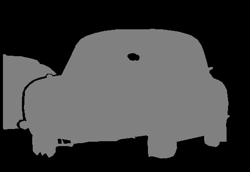

# FCN图像分割

#### 构建了一个FCN全卷积网络模型用于分割图片中的车辆。数据集是Pascal2 VOC2012，分类网络是vgg_16，对卷积池化后得到的特征图进行8x上采样，最后用交叉熵计算loss损失进行优化，完成图像的分割。

## 1 &nbsp;算法
#### 参考论文《Fully Convolutional Networks for Semantic Segmentation》(https://arxiv.org/abs/1411.4038) ，编写上采样代码。上采样的过程及代码如下：
##### 1) 首先调用vgg_16,卷积池化得到的logits和end_points用于后面的上采样。
    with slim.arg_scope(vgg.vgg_arg_scope()):
        logits, end_points = vgg.vgg_16(image_tensor,
                                        num_classes=number_of_classes,
                                        is_training=is_training_placeholder,
                                        spatial_squeeze=False,
                                        fc_conv_padding='SAME')
##### 2) 对vgg_16预训练模型中pool5的输出特征进行2x上采样。
    upsample_filter_np_x2 = bilinear_upsample_weights(2, number_of_classes)        
    upsample_filter_tensor_x2 = tf.Variable(upsample_filter_np_x2, name='vgg_16/fc8/t_conv_x4')
    upsampled_logits_pool5 = tf.nn.conv2d_transpose(logits, upsample_filter_tensor_x2,
                                            output_shape=tf.shape(aux_logits_16s),
                                            strides=[1, 2, 2, 1],
                                            padding='SAME')
##### 3) 对vgg_16预训练模型中pool4的输出特征进行(1,1)卷积, 然后把pool4(1,1)卷积后的特征插入到pool5进行2x上采样后的特征中，形成新的特征。再对新特征upsampled_logits_pool4进行2x上采样。
    pool4_feature = end_points['vgg_16/pool4']
    with tf.variable_scope('vgg_16/fc8'):
        aux_logits_16s = slim.conv2d(pool4_feature, number_of_classes, [1, 1],
                                    activation_fn=None,
                                    weights_initializer=tf.zeros_initializer,
                                    scope='conv_pool4')
    upsampled_logits_pool4 = upsampled_logits_pool5 + aux_logits_16s
    upsampled_logits_pool4 = tf.nn.conv2d_transpose(upsampled_logits_pool4, upsample_filter_tensor_x2,
                                            output_shape=tf.shape(aux_logits_8s),
                                            strides=[1, 2, 2, 1],
                                            padding='SAME')
##### 4) 对vgg_16预训练模型中pool3的输出特征进行(1,1)卷积,然后把pool3(1,1)卷积后的特征插入到pool4进行2x上采样后的特征中，形成新的特征。再对新特征upsampled_logits进行8x上采样。
    pool3_feature = end_points['vgg_16/pool3']
    with tf.variable_scope('vgg_16/fc8'):
        aux_logits_8s = slim.conv2d(pool3_feature, number_of_classes, [1, 1],
                                    activation_fn=None,
                                    weights_initializer=tf.zeros_initializer,
                                    scope='conv_pool3')   
    upsampled_logits = upsampled_logits_pool4 + aux_logits_8s
    upsample_filter_np_x8 = bilinear_upsample_weights(upsample_factor, number_of_classes)
    upsample_filter_tensor_x8 = tf.Variable(upsample_filter_np_x8, name='vgg_16/fc8/t_conv_x8')
    upsampled_logits = tf.nn.conv2d_transpose(upsampled_logits, upsample_filter_tensor_x8,
                                            output_shape=upsampled_logits_shape,
                                            strides=[1, upsample_factor, upsample_factor, 1],
                                            padding='SAME')

## 2 &nbsp;结果
#### 模型训练完成后，拿一张汽车的图片进行校验，得到的结果如下。
汽车的原始图片：      
           
汽车的类别标签：      
           
预测得到的汽车分割图片：    
           
CRF(条件随机场)之后预测得到的汽车分割图片：     
          
